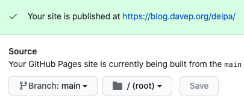

# About

This is `delpa`, a small personal package archive for GNU Emacs. It isn't
intended as an alternative archive or anything like that, it's simply an
archive of personal code that I host via GitHub pages so I can quickly and
easily set up or update a GNU Emacs installation.

Information on how this came about can be found in a blog
post
[I wrote in April 2017](http://blog.davep.org/2017/04/01/another_revamp_of_my_emacs_config.html).

The code that lives here is the sort of thing that would make no sense in an
archive such as <a href="https://melpa.org/#/">melpa</a>, or which is in the
process of being tidied up for submission to melpa.

# How to do the same yourself

If you've stumbled on this page because you're thinking of doing the same
thing (creating and managing your own personal elisp archive), here's a
brief overview of what I did to get this going.

## Create a GitHub repo

Dur!

## Set the GitHub repo to publish pages

In the settings for the repo find the `GitHub Pages` section and set the
source to the `master` branch (or, I guess, some other branch if that's your
thing). Mine looks like this:



See
the
[GitHub documentation about GitHub pages for more help](https://help.github.com/articles/configuring-a-publishing-source-for-github-pages/).

## Clone it to your local machine

Again, dur!

## Set up emacs for package uploading

Somewhere in your `~/.emacs.d/init.el` you want to do something like this:

```elisp
(require 'package-x)
(setq package-archive-upload-base "~/some/path/to/the/local/repo")
```

## Add stuff to your new repo

With all of the above done, you should be set to add your own packages to
the repo. Be sure to use `package-lint-current-buffer` and `checkdoc` so
that you know you have nice clean packages to add to it. Once you have a
body of code in a nice clean package you can do:

<kbd>M-X</kbd> <kbd>package-upload-buffer</kbd> <kbd>RET</kbd>

and the package will be added to your archive. Head back off to the repo, do
the usual `git` dance to add new stuff, commit it, and push it all back up
to GitHub.

After a short while your shiny new personal package archive should be
available to use.

## Actually using the package archive

There's a couple or so ways of going about it, but in each case you'll want
to add the GitHub pages URL to `package-archives`. For example, I do this
near the top of my `init.el`, where I set up use of the Emacs package
system:

```elisp
(require 'package)
(add-to-list 'package-archives '("melpa" . "http://melpa.org/packages/"))
(add-to-list 'package-archives '("delpa" . "http://blog.davep.org/delpa/"))
(package-initialize)
```

## And that's it!

I know this is a bit of a quick romp through the very basic facts, but
hopefully there's enough here to point you in the right direction. See also
my blog post I mention at the state of this document for how I went about
then managing, loading and installing my own and other packages. You might
also want to have a look at my
own [`~/.emacs.d/`](https://github.com/davep/.emacs.d) to see how it all
hangs together.

And, also.... don't just take my word for it. This is just my way of doing
things, that works for me. I imagine there's other approaches written by far
smarter people than me out there; I'd recommend doing more reading.
